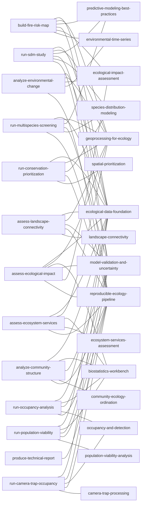

# Skill Taxonomy Diagram

Mermaid diagrams showing all 17 skills, their dependency relationships, and workflow memberships.

---

## Skill Dependency Graph

```mermaid
flowchart TD

    %% ── Foundation layer (Phase 1) ──────────────────────────────────────────
    EDF["1. ecological-data-foundation\n(data ingestion, cleaning, QA)"]
    GEO["2. geoprocessing-for-ecology\n(CRS, raster/vector, extraction)"]
    BIO["3. biostatistics-workbench\n(GLM/GLMM, hypothesis testing)"]
    PMB["4. predictive-modeling-best-practices\n(CV, collinearity, tuning)"]
    REP["12. reproducible-ecology-pipeline\n(provenance, audit, logging)"]

    %% ── Analysis layer (Phase 2) ─────────────────────────────────────────────
    MVU["5. model-validation-and-uncertainty\n(AUC/TSS, calibration, uncertainty)"]
    SDM["6. species-distribution-modeling\n(MaxEnt, BRT, ensemble, projection)"]
    EIA["9. ecological-impact-assessment\n(BACI, fragmentation, pressure)"]
    ETS["10. environmental-time-series\n(trend, breakpoint, anomaly)"]

    %% ── Advanced layer (Phase 3) ─────────────────────────────────────────────
    OCC["7. occupancy-and-detection\n(psi/p estimation, replicated visits)"]
    COM["8. community-ecology-ordination\n(NMDS, PCA, diversity, PERMANOVA)"]
    ESA["11. ecosystem-services-assessment\n(ES indicators, trade-offs)"]

    %% ── Specialist layer (Phase 4) ───────────────────────────────────────────
    CAM["13. camera-trap-processing\n(detection events, diel activity)"]
    ACO["14. acoustic-monitoring\n(ACI/NDSI, BirdNET, soundscape)"]
    LC["15. landscape-connectivity\n(IIC/dPC, resistance, corridors)"]
    PVA["16. population-viability-analysis\n(lambda, stochastic PVA, IUCN E)"]
    SPR["17. spatial-prioritization\n(prioritizr, Marxan, reserve design)"]

    %% ── Universal dependencies ───────────────────────────────────────────────
    EDF --> GEO
    EDF --> BIO
    EDF --> PMB
    EDF --> SDM
    EDF --> OCC
    EDF --> COM
    EDF --> EIA
    EDF --> ETS
    EDF --> ESA
    EDF --> CAM
    EDF --> ACO
    EDF --> LC
    EDF --> PVA
    EDF --> SPR
    EDF --> REP

    GEO --> SDM
    GEO --> EIA
    GEO --> ESA
    GEO --> LC
    GEO --> SPR

    PMB --> SDM
    BIO --> OCC
    BIO --> COM
    BIO --> EIA
    BIO --> ESA
    BIO --> PVA

    SDM --> MVU
    EIA --> MVU
    COM --> MVU
    OCC --> MVU

    SDM --> SPR
    ESA --> SPR
    CAM --> OCC
    ACO --> ETS

    %% ── REP wraps every skill ────────────────────────────────────────────────
    GEO --> REP
    BIO --> REP
    PMB --> REP
    MVU --> REP
    SDM --> REP
    OCC --> REP
    COM --> REP
    EIA --> REP
    ETS --> REP
    ESA --> REP
    CAM --> REP
    ACO --> REP
    LC  --> REP
    PVA --> REP
    SPR --> REP

    %% ── Styles by phase ──────────────────────────────────────────────────────
    classDef phase1 fill:#d0e8ff,stroke:#3a7abf,color:#000
    classDef phase2 fill:#d4f0d4,stroke:#3a8a3a,color:#000
    classDef phase3 fill:#fff2cc,stroke:#b8860b,color:#000
    classDef phase4 fill:#ffe0e0,stroke:#c0392b,color:#000
    classDef repro  fill:#e8d8f8,stroke:#7d3c98,color:#000

    class EDF,GEO,BIO,PMB phase1
    class MVU,SDM,EIA,ETS phase2
    class OCC,COM,ESA phase3
    class CAM,ACO,LC,PVA,SPR phase4
    class REP repro
```

**Legend:**
| Colour | Phase | Description |
|--------|-------|-------------|
| Blue | Phase 1 | Foundation — data, spatial, statistics, ML best-practices |
| Green | Phase 2 | Analysis — SDM, validation, impact, time series |
| Yellow | Phase 3 | Advanced analysis — occupancy, community, ecosystem services |
| Red | Phase 4 | Specialist — camera trap, acoustics, connectivity, PVA, prioritization |
| Purple | All | `reproducible-ecology-pipeline` — wraps every skill |

---

## Workflow Membership

---

## Skill Phase Summary

| Phase | Skill IDs | Count |
|-------|-----------|-------|
| 1 — Foundation | 1, 2, 3, 4, 12 | 5 |
| 2 — Analysis | 5, 6, 9, 10 | 4 |
| 3 — Advanced | 7, 8, 11 | 3 |
| 4 — Specialist | 13, 14, 15, 16, 17 | 5 |
| **Total** | | **17** |
